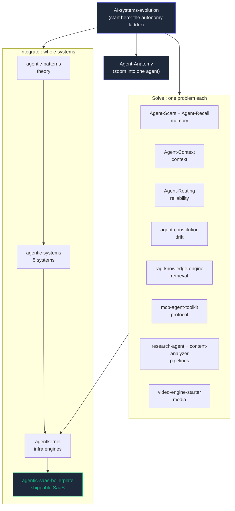

<div align="center">

# The Machine OS

### Agent systems engineering, from first principles. 16 open-source repos, one map.

A self-taught engineer hit the four problems that break every real agent system
(memory, context, reliability, drift), solved each inside production code, then
extracted the patterns into small repos you can run in a minute. This is the map.

[]()
[]()
[]()
[](LICENSE)

<br>


</div>

---

## What this is

Most "learn agents" resources are either toy demos or 400-page theory. This is neither.

Every repo here was pulled out of a system that actually shipped. The path is built
so you can start at the idea ("what even is an agent?") and climb all the way to a
billable multi-agent SaaS, running real code at each step. No signup, no keys for most
of it: clone, `node main.js`, watch it work.

If a repo here helps you, a star is the cheapest way to say thanks and the only way
others find it.

---

## Start here

**[AI-systems-evolution](https://github.com/shubham0086/AI-systems-evolution)** is the front door.

It solves the *same* task at six levels of autonomy (plain code to a swarm) so you can
*feel* the difference between a workflow, an agent, and a multi-agent system instead of
arguing about definitions. Six folders, one minute each, zero setup.

```bash
git clone https://github.com/shubham0086/AI-systems-evolution
cd AI-systems-evolution && node 00-plain-code/main.js   # then 01, 02, 03, 03.5, 04, 05
```

Once the ladder makes sense, pick a path below.

---

## Pick your path

### Track A : Understand what an agent is made of

| Step | Repo | What you get |
|------|------|--------------|
| 1 | [AI-systems-evolution](https://github.com/shubham0086/AI-systems-evolution) | The six-rung autonomy ladder, plus a bridge rung on memory |
| 2 | [Agent-Anatomy](https://github.com/shubham0086/Agent-Anatomy) | One agent dissected into four organs (brain, hands, memory, loop). Toggle one off, watch it break |

### Track B : Solve one specific problem

Each repo isolates one hard problem, extracted from production. Grab the one you have.

| Problem | Repo | Tests |
|---------|------|-------|
| Agents forget across sessions | [Agent-Scars](https://github.com/shubham0086/Agent-Scars) (failure memory) · [Agent-Recall](https://github.com/shubham0086/Agent-Recall) (solution memory) | 7 · 9 |
| Token waste re-reading code | [Agent-Context](https://github.com/shubham0086/Agent-Context) (dependency graph + blast radius) | 6 |
| One LLM provider goes down | [Agent-Routing](https://github.com/shubham0086/Agent-Routing) (multi-provider failover + circuit breaker) | 23 |
| Agents drift from their rules | [agent-constitution](https://github.com/shubham0086/agent-constitution) (drift detection) | 6 |
| RAG returns junk | [rag-knowledge-engine](https://github.com/shubham0086/rag-knowledge-engine) (hybrid BM25+vector RRF + rerank + eval) | 25 |
| Tools need a standard protocol | [mcp-agent-toolkit](https://github.com/shubham0086/mcp-agent-toolkit) (MCP server: blackboard, scars, cache) | 13 |
| Research a topic end to end | [research-agent](https://github.com/shubham0086/research-agent) (SerpAPI + Tavily + Brave + DDG fallback) | 9 |
| Turn a URL into structured data | [content-analyzer](https://github.com/shubham0086/content-analyzer) (summary, sentiment, quality score) | 4 |
| Turn a brief into a video | [video-engine-starter](https://github.com/shubham0086/video-engine-starter) (Remotion + routing + TTS cascade) | demo |

### Track C : Build and ship a whole system

| Step | Repo | What you get |
|------|------|--------------|
| 1 | [agentic-patterns](https://github.com/shubham0086/agentic-patterns) | 7 architecture patterns with runnable Node and Python starters |
| 2 | [agentic-systems](https://github.com/shubham0086/agentic-systems) | 5 complete, standalone agent systems |
| 3 | [agentkernel](https://github.com/shubham0086/agentkernel) | 6 production engines, in both Python and JavaScript |
| 4 | [agentic-saas-boilerplate](https://github.com/shubham0086/agentic-saas-boilerplate) | A billable multi-agent SaaS template (DAG scheduler, SSE, Stripe/Razorpay) |

---

## The map



---

## The problems, and what solves each

| Problem | Pattern | Repo |
|---------|---------|------|
| Agents forgetting across sessions | Reality-first persistent memory | Agent-Scars, Agent-Recall |
| Token waste from re-reading code | Dependency context graph + blast radius | Agent-Context |
| A single LLM provider failing | Multi-provider router + circuit breaker + ordered failover | Agent-Routing |
| Brittle linear agent chains | DAG orchestration with Kahn's topological scheduling | agentic-patterns, agentkernel |
| Agents drifting and repeating failures | Anti-drift rules + a repeat-failure guard (SCAR) | agent-constitution, Agent-Scars |
| Prompt injection and secret leakage | Input and output guardrails, tested against real payloads | agentkernel |
| RAG returning irrelevant chunks | Hybrid BM25 + vector retrieval, RRF fusion, cross-encoder rerank | rag-knowledge-engine |
| Tools with no shared protocol | An MCP server exposing blackboard, memory, and cache | mcp-agent-toolkit |

---

## The handbook

The repos above are the runnable core. Around them, this repo is growing into a handbook for
building **AI systems that don't break in production** - written for senior engineers, tech
leads, and platform engineers.

| Section | What's in it |
|---------|--------------|
| **[REPOSITORIES/](REPOSITORIES/)** | An index card per repo: problem → architecture → lessons → demo |
| **[SYSTEM-RECIPES/](SYSTEM-RECIPES/)** | Start from what you want to build (a RAG system, an MCP server, an agent team) |
| **[FIELD-NOTES/](FIELD-NOTES/)** | The long-form essays - token economics, banned probabilistic control flow, production MCP |
| **[ROADMAP.md](ROADMAP.md)** | What ships next (architectures, security, workflows) and what's deliberately parked |
| **[NOW.md](NOW.md)** | What I'm actively building this month |

The hook, plainly: most resources teach you to *build AI apps faster*. This one is about
building **AI systems that don't break**.

---

## Who built this and why

Five years in enterprise IT operations (SAP, ServiceNow, strict SLAs), then about two
years teaching myself to build production AI systems alone. The hard parts were never
"call an LLM", they were the systems problems above. I solved each inside my own
codebases, then open-sourced the patterns so other self-taught builders do not have to
learn it all the hard way.

Long-form case studies, architecture diagrams, and a live RAG chatbot that answers
questions about all of this are on the portfolio site.

<div align="center">

[Portfolio site](https://my-portfolio-github-io-beta-five.vercel.app) ·
[LinkedIn](https://linkedin.com/in/shubham-prajapati086) ·
Built by [Shubham Prajapati](https://github.com/shubham0086) ·
Content: CC BY 4.0

If any of these repos saved you time, a star on that repo is how others find it.

</div>
