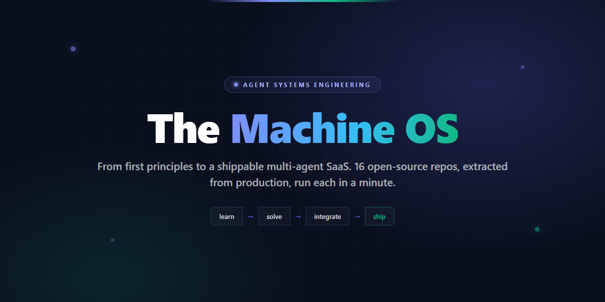
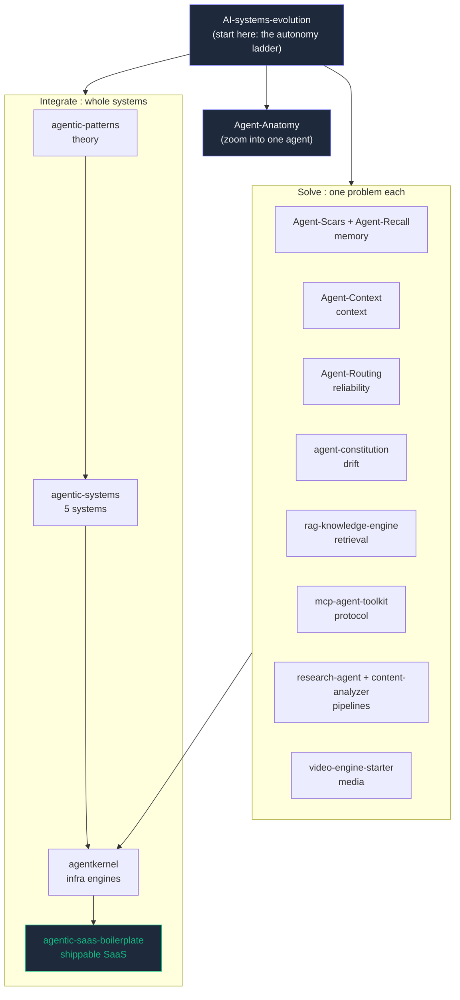

<div align="center">

# The Machine OS

### Agent systems engineering, from first principles. 16 open-source repos, one map.

A self-taught engineer hit the four problems that break every real agent system
(memory, context, reliability, drift), solved each inside production code, then
extracted the patterns into small repos you can run in a minute. This is the map.

[]()
[]()
[]()
[](LICENSE)

[](https://github.com/shubham0086/the-machine-os/stargazers)
[](https://github.com/shubham0086/the-machine-os/network/members)
[](https://github.com/shubham0086/the-machine-os/commits)
[](https://github.com/shubham0086/the-machine-os)

<br>



</div>

---

## Install and use

Turn your AI IDE into a senior engineer's workbench. There are two pieces, and you
only need the first:

1. **ai-engineering** : 23 engineering skills across 3 tiers. Pure prompts, work standalone, no setup.
2. **ai-engineering-tools** *(optional)* : MCP tool backends that supercharge the skills
   with things a prompt alone can't see (today: whole-repo blast radius, failure memory,
   and PDF→validated-JSON extraction).

### Prerequisites

| For | You need |
|-----|----------|
| The skills (step 1) | [Claude Code](https://claude.com/claude-code) v2.1.3 or newer. Nothing else, no keys. |
| The optional tools (step 2) | [Node.js](https://nodejs.org) 18+ for the Node spokes (run via `npx`), plus [uv](https://docs.astral.sh/uv/) for the Python `agent-extractor` spoke (runs via `uvx`)[...]

### Step 1 : install the skills (free, no keys)

```bash
/plugin marketplace add shubham0086/the-machine-os
/plugin install ai-engineering@machine-os
/reload-plugins
```

The `/reload-plugins` step is what makes the skills appear (the install prints a
reminder for it). All 23 then show up namespaced as `/ai-engineering:<skill>`.

The skills are organized into three tiers. The tier is metadata (a `tier:` field), not a
folder, so install stays one step. Every skill follows the
[skill contract](plugins/ai-engineering/SKILL-CONTRACT.md): it produces a human-readable
artifact and appends a machine-readable `machine_output` block, so one skill's output feeds the
next (`requires` / `produces` / `feeds`). That turns the set from a skill library into a skill
network.

**Tier 1 : Engineering** (build it right)

| Skill | What it does |
|-------|--------------|
| `/requirements-analysis` | Turn a vague goal into testable functional + non-functional requirements |
| `/system-design` | Design a scalable system with NFRs, data model, and a resiliency matrix |
| `/architecture` | Write or evaluate an architecture decision record (ADR) |
| `/architecture-review` | Staff-level review of a whole system, scored on scalability/reliability/security/cost/complexity |
| `/api-design` | Design or review a REST/GraphQL contract (semantics, versioning, idempotency) |
| `/database-design` | Model a schema; keys, relationships, indexing, SQL-vs-NoSQL fit |
| `/code-review` | Security, performance, and correctness review of a diff or PR |
| `/performance-review` | Find and impact-rank bottlenecks (N+1, complexity, hot paths) |
| `/testing-strategy` | A test plan balancing coverage, speed, and maintenance |
| `/tech-debt` | Audit and prioritize debt with WSJF scoring |
| `/debug` | Structured reproduce, isolate, diagnose, and fix |
| `/documentation` | READMEs, API docs, runbooks, and onboarding guides |

**Tier 2 : Security & Operations** (keep it safe and running)

| Skill | What it does |
|-------|--------------|
| `/security-review` | Audit code/API/design for injection, broken access control, and exposure |
| `/threat-model` | STRIDE threat model: assets, trust boundaries, threats, mitigations |
| `/deploy-checklist` | Pre-deploy verification with rollback triggers |
| `/incident-response` | Triage, status updates, and a blameless postmortem |
| `/standup` | Turn recent activity into a yesterday / today / blockers update |

**Tier 3 : Intelligence** (the autonomy / AI layer)

| Skill | What it does |
|-------|--------------|
| `/task-decomposition` | Break a goal into an ordered, dependency-aware task plan |
| `/agent-design` | Design or review an agent: tools, control loop, guardrails, HITL |
| `/prompt-review` | Treat a prompt as a contract: clarity, output shape, failure handling |
| `/rag-review` | Decide the retrieval strategy first, then review the pipeline |
| `/document-extraction` | Decide the extraction strategy, then turn messy PDFs into validated structured JSON |
| `/hallucination-audit` | Claim-by-claim groundedness check on any generated text |

### Step 2 *(optional)* : add the tools to supercharge the skills

The skills work great on a diff you paste in. But built-in code review only sees the
diff. Install the tools and `/code-review` and `/tech-debt` also see your **whole repo's
dependency graph**, so they can tell you *"this 3-line change has 12 dependents, here's
what it can break"*, which the diff alone can never show.

```bash
/plugin install ai-engineering-tools@machine-os
/reload-plugins
```

This plugin adds **no new slash commands**. It runs small MCP servers (`code-graph`,
`agent-memory`, and `agent-extractor`) in the background; the skills call them
automatically when they need them. The Node spokes need Node 18+; the Python
`agent-extractor` spoke runs via `uvx`, so it needs [uv](https://docs.astral.sh/uv/) on
your PATH.

### How to use it

Once installed, every skill triggers two ways:

- **Type it:** `/ai-engineering:code-review` (or any skill from the table).
- **Just ask:** describe the task in plain language, for example *"review this PR before
  I merge"* or *"is this change safe?"*, and the matching skill fires on its own.

When the tools plugin is also installed, you don't do anything different. The skill
notices the `code-graph` tool is available and pulls the blast radius in mid-review. No
extra step, no extra command.

Every skill **works standalone**, no setup or keys. Connect more of your tools (source
control, monitoring, project tracker) and the same skills get supercharged: they pull
the context instead of you pasting it. See
[CONNECTORS.md](plugins/ai-engineering/CONNECTORS.md) for the map.

### Troubleshooting

- **A skill says "No commands match" right after install.** You skipped `/reload-plugins`.
  Skills do not register until you reload. This is the single most common gotcha.
- **`/code-review` runs but never mentions blast radius.** The tools plugin isn't
  installed, or Node 18+ isn't on your PATH. Run `node --version` to check, then redo
  step 2.
- **Two `code-review` commands appear.** Claude Code ships its own `code-review`. Yours
  is always the namespaced `/ai-engineering:code-review`, so they never collide.

> **Status & support.** This is a personal project, maintained in spare time. The skills
> are content under CC BY 4.0, free to use as-is. Issues and PRs are welcome, but
> responses may be slow and selective. If something here saves you time, a star is the
> best thank-you.

---

## What this is

Most "learn agents" resources are either toy demos or 400-page theory. This is neither.

Every repo here was pulled out of a system that actually shipped. The path is built
so you can start at the idea ("what even is an agent?") and climb all the way to a
billable multi-agent SaaS, running real code at each step. No signup, no keys for most
of it: clone, `node main.js`, watch it work.

If a repo here helps you, a star is the cheapest way to say thanks and the only way
others find it.

---

## Start here

**[AI-systems-evolution](https://github.com/shubham0086/AI-systems-evolution)** is the front door.

It solves the *same* task at six levels of autonomy (plain code to a swarm) so you can
*feel* the difference between a workflow, an agent, and a multi-agent system instead of
arguing about definitions. Six folders, one minute each, zero setup.

```bash
git clone https://github.com/shubham0086/AI-systems-evolution
cd AI-systems-evolution && node 00-plain-code/main.js   # then 01, 02, 03, 03.5, 04, 05
```

Once the ladder makes sense, pick a path below.

---

## Pick your path

### Track A : Understand what an agent is made of

| Step | Repo | What you get |
|------|------|--------------|
| 1 | [AI-systems-evolution](https://github.com/shubham0086/AI-systems-evolution) | The six-rung autonomy ladder, plus a bridge rung on memory |
| 2 | [Agent-Anatomy](https://github.com/shubham0086/Agent-Anatomy) | One agent dissected into four organs (brain, hands, memory, loop). Toggle one off, watch it break |

### Track B : Solve one specific problem

Each repo isolates one hard problem, extracted from production. Grab the one you have.

| Problem | Repo | Tests |
|---------|------|-------|
| Agents forget across sessions | [Agent-Scars](https://github.com/shubham0086/Agent-Scars) (failure memory) · [Agent-Recall](https://github.com/shubham0086/Agent-Recall) (solution memory) | 7 |
| Token waste re-reading code | [Agent-Context](https://github.com/shubham0086/Agent-Context) (dependency graph + blast radius) | 6 |
| One LLM provider goes down | [Agent-Routing](https://github.com/shubham0086/Agent-Routing) (multi-provider failover + circuit breaker) | 23 |
| An unattended agent ships unsafe behaviour | [agent-sim](https://github.com/shubham0086/agent-sim) (pre-deploy simulation: adversarial scenarios, SLO + regression gates) | 15 |
| An agent's credential gets hijacked | [agent-identity](https://github.com/shubham0086/agent-identity) (scoped, short-lived, signed credentials + audit + revocation) | 21 |
| Agents drift from their rules | [agent-constitution](https://github.com/shubham0086/agent-constitution) (drift detection) | 6 |
| RAG returns junk | [rag-knowledge-engine](https://github.com/shubham0086/rag-knowledge-engine) (hybrid BM25+vector RRF + rerank + eval) | 25 |
| Messy PDFs, no clean data to retrieve over | [agent-extractor](https://github.com/shubham0086/agent-extractor) (VLM extract + financial coherence validation) | 24 |
| Tools need a standard protocol | [mcp-agent-toolkit](https://github.com/shubham0086/mcp-agent-toolkit) (MCP server: blackboard, scars, cache) | 13 |
| Research a topic end to end | [research-agent](https://github.com/shubham0086/research-agent) (SerpAPI + Tavily + Brave + DDG fallback) | 9 |
| Turn a URL into structured data | [content-analyzer](https://github.com/shubham0086/content-analyzer) (summary, sentiment, quality score) | 4 |
| Turn a brief into a video | [video-engine-starter](https://github.com/shubham0086/video-engine-starter) (Remotion + routing + TTS cascade) | demo |

### Track C : Build and ship a whole system

| Step | Repo | What you get |
|------|------|--------------|
| 1 | [agentic-patterns](https://github.com/shubham0086/agentic-patterns) | 7 architecture patterns with runnable Node and Python starters |
| 2 | [agentic-systems](https://github.com/shubham0086/agentic-systems) | 5 complete, standalone agent systems |
| 3 | [agentkernel](https://github.com/shubham0086/agentkernel) | 6 production engines, in both Python and JavaScript |
| 4 | [agentic-saas-boilerplate](https://github.com/shubham0086/agentic-saas-boilerplate) | A billable multi-agent SaaS template (DAG scheduler, SSE, Stripe/Razorpay) |

---

## The map



---

## The problems, and what solves each

| Problem | Pattern | Repo |
|---------|---------|------|
| Agents forgetting across sessions | Reality-first persistent memory | Agent-Scars, Agent-Recall |
| Token waste from re-reading code | Dependency context graph + blast radius | Agent-Context |
| A single LLM provider failing | Multi-provider router + circuit breaker + ordered failover | Agent-Routing |
| Brittle linear agent chains | DAG orchestration with Kahn's topological scheduling | agentic-patterns, agentkernel |
| Agents drifting and repeating failures | Anti-drift rules + a repeat-failure guard (SCAR) | agent-constitution, Agent-Scars |
| Prompt injection and secret leakage | Input and output guardrails, tested against real payloads | agentkernel |
| RAG returning irrelevant chunks | Hybrid BM25 + vector retrieval, RRF fusion, cross-encoder rerank | rag-knowledge-engine |
| Documents that are pictures of tables, not text | VLM extraction + schema + arithmetic coherence validation | agent-extractor |
| Tools with no shared protocol | An MCP server exposing blackboard, memory, and cache | mcp-agent-toolkit |
| Unattended agents shipping unsafe behaviour | Pre-deploy simulation: adversarial scenarios, SLO + regression gates | agent-sim |
| Hijacked agent credentials (confused deputy) | Scoped, short-lived, signed identities + audit + revocation | agent-identity |

---

## The handbook

The repos above are the runnable core. Around them, this repo is growing into a handbook for
building **AI systems that don't break in production** - written for senior engineers, tech
leads, and platform engineers.

| Section | What's in it |
|---------|--------------|
| **[REPOSITORIES/](REPOSITORIES/)** | An index card per repo: problem → architecture → lessons → demo |
| **[SYSTEM-RECIPES/](SYSTEM-RECIPES/)** | Start from what you want to build (a RAG system, an MCP server, an agent team) |
| **[ARCHITECTURES/](ARCHITECTURES/)** | How the pieces fit: agent anatomy, multi-agent orchestration, memory, routing, MCP |
| **[AI-ENGINEERING/](AI-ENGINEERING/)** | The craft under the architectures: prompting as a contract, context engineering, evaluation, tool-calling |
| **[SYSTEMS/](SYSTEMS/)** | Deep write-ups of systems that shipped: the Sovereign SDLC engine, Agency OS, the live RAG chatbot |
| **[CASE-STUDIES/](CASE-STUDIES/)** | Postmortems and architecture decision records: the 49-garbage-files collapse, doc drift, keeping the engine native |
| **[SECURITY/](SECURITY/)** | Real incidents and real guards: secret rotation, repo hygiene, agent execution safety |
| **[WORKFLOWS/](WORKFLOWS/)** | How I actually work: the self-healing context loop, reality-driven development, publishing compliance |
| **[FIELD-NOTES/](FIELD-NOTES/)** | The long-form essays - token economics, banned probabilistic control flow, production MCP |
| **[RESEARCH/](RESEARCH/)** | The one forward-looking section: the autonomy-ladder thesis, and where agent systems are heading (A2A, agent identity, small models, ambient) |
| **[ROADMAP.md](ROADMAP.md)** | What's shipped, what ships next, and what's deliberately parked |
| **[NOW.md](NOW.md)** | What I'm actively building this month |

The hook, plainly: most resources teach you to *build AI apps faster*. This one is about
building **AI systems that don't break**.

---

## Who built this and why

Five years in enterprise IT operations (SAP, ServiceNow, strict SLAs), then about two
years teaching myself to build production AI systems alone. The hard parts were never
"call an LLM", they were the systems problems above. I solved each inside my own
codebases, then open-sourced the patterns so other self-taught builders do not have to
learn it all the hard way.

Long-form case studies, architecture diagrams, and a live RAG chatbot that answers
questions about all of this are on the portfolio site.

<div align="center">

[Portfolio site](https://my-portfolio-github-io-beta-five.vercel.app) ·
[LinkedIn](https://linkedin.com/in/shubham-prajapati086) ·
Built by [Shubham Prajapati](https://github.com/shubham0086) ·
Content: CC BY 4.0

If any of these repos saved you time, a star on that repo is how others find it.

</div>
